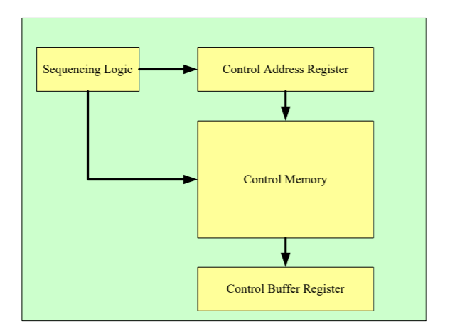

# CPU

要有外围寄存器

CU必须用微程序设计方式

## 结构介绍

包含RAM

8bit地址->256个地址，每个数据16bit，RAM=16*256

### 内部寄存器

MAR：
*   MAR存放着要从存储器中读取或要写入存储器的存储器地址。
*   此处，“读”定义为CPU从内存中读。“写”定义为CPU把数据写入内存。
*   本课程的设计中，MAR拥有8比特，可以存取256个地址。

MBR：
*   MBR存储着将要被存入内存或者最后一次从内存中读出来的数值。
*   本课程的设计中，MBR有16比特。

PC：
*   PC寄存器用来跟踪程序中将要使用的指令。
*   本课程中，PC有8比特。

IR：
*   IR存放指令的OPCODE（操作码）部分。
*   本课程中，IR有8比特->256种指令。

BR：
*   BR作为ALU的一个输入，存放着ALU的一个操作数。
*   本课程中，BR有16比特。

ACC：
*   ACC保存着ALU的另一个操作数，而且通常ACC存放着ALU的计算结果。
*   本课程中，ACC有16比特。

### 指令集

单地址

大部分是直接寻址，少数是立即数寻址

带方括号的是直接寻址而非立即数，譬如ADD

MPY里用到了MR，存储高16位数据

### ALU

还可以增加与BR的互动来实现乘法，也可以用移位相加实现，而在FPGA有乘法资源，可以直接运算乘法

### 存储器

建议调用IP核直接实现

### 微程序控制器设计

#### 控制器内部结构

可以用简单的结构而非这四个模块，譬如一个模块 + Control Memory，但是要体现微程序思想

每个指令都要把这个写在报告里
