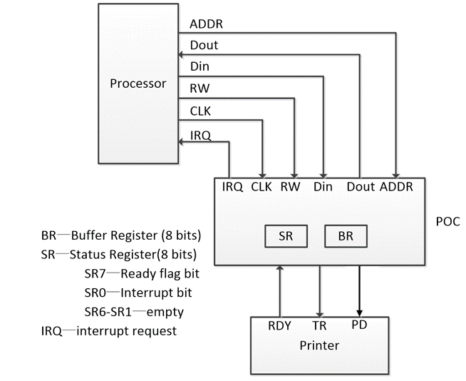

# POC

parallel output controller 并行输出控制器

## 结构介绍

### POC 寄存器

BR：Buffer Register，8bit缓冲寄存器，存放要打印的数据，再传给打印机

SR：State Register，8bit状态寄存器，握手过程中承上起下，表征POC状态
*   SR7：Ready flag bit
*   SR0:Interrupt bit
*   SR6-SR1：empty

### 与 Processor

IRQ：interrupt request，中断请求信号

ADDR：address，选择SR or BR，因此可以只有1bit

Din：Processor传给POC，SR/BR

Dout：POC回写数据

RW：读/写信号

CLK：时钟信号

必须用同步时序电路设计

### 与 Printer

PD：Parallel Data，即 BR 中的数据，待打印的数据

TR：Transport Request，请求打印信号

RDY：Ready，标志 Printer 已经准备好

POC为核心，实际上为计时器

Processor建议要做，来配合POC

Printer一定要设计

## 设计思路

### CPU 与 POC 接口

#### 查询方式

SR0一直为0

查询SR7要有一个读SR7的动作

CPU置SR7为0，表明CPU已经写入新数据但尚未被处理

POC检测SR7为0，开始与打印机握手，完毕后将SR7置1，表明准备好

#### 中断方式

SR0一直为1，SR0用于表示POC在何种方式下

POC将数据送至打印机后，将SR7置为1（准备好），此时由于SR7=1且SR0=1，POC会发送中断请求IRQ信号，CPU收到IRQ信号后，不会查询SR7，直接选中BR，将数据写入BR，然后CPU将SR7置为0，表明CPU已经写入新数据且尚未被处理。

POC如果检测到SR7被置为0，表明收到新数据，开始与外设（打印机）握手操作，操作完成后POC将SR7置为1，由于SR0=1，使得IRQ信号拉低为低电平0，即发出中断请求。

### POC 与打印机接口

当打印机准备好接收新的数据时，打印机将RDY置为1，等待新的数据从POC送来。POC完成与CPU的握手后，将数据送到PD端口。

POC检测到打印机的RDY=1，在TR发送脉冲，表明发送请求，打印机检测到TR后，将RDY置为0，接收PD的数据送至打印。

延迟一段时间（模拟打印过程），打印完成后，打印机又将RDY置为1，表明准备好。

## 设计要求

用开关之类的东西选择两种方式中的一种

